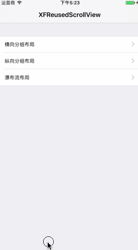

# XFReusedScrollView
[](http://cocoadocs.org/docsets/XFDialogBuilder)


Powerful reused scrollView for IOS. Support custom layout config.




## Installation
### CocoaPods
```ruby
pod 'XFReusedScrollView'
```

### Manual
Copy all files under `~/XFReusedScrollView` folder  to your project.
